# UCI Adult 收入数据集：完整 EDA + 机器学习建模

> 数据来源：`raw-data/adult.data`（UCI Machine Learning Repository，Census Income / Adult 数据集，无表头 CSV，32 561 条记录，15 列）
> 目标：分析人群特征并预测年收入是否大于 50K 美元

## 字段说明

| 类别 | 列名 | 类型 | 说明 |
| --- | --- | --- | --- |
| 数值 | age | int | 年龄 |
| 数值 | workclass | str | 雇佣类型 |
| 数值 | fnlwgt | int | final weight，人口权重 |
| 数值 | education | str | 学历 |
| 数值 | education-num | int | 学历数值化（1–16） |
| 数值 | marital-status | str | 婚姻状况 |
| 数值 | occupation | str | 职业 |
| 数值 | relationship | str | 家庭角色 |
| 数值 | race | str | 种族 |
| 数值 | sex | str | 性别 |
| 数值 | capital-gain | int | 资本收益 |
| 数值 | capital-loss | int | 资本损失 |
| 数值 | hours-per-week | int | 每周工作小时 |
| 数值 | native-country | str | 原籍 |
| 目标 | income | str | `<=50K` / `>50K` |

> 注意：原数据集中缺失值以 `" ?"`（带前导空格）出现。`pd.read_csv` 中使用 `na_values="?"` + `skipinitialspace=True` 识别。

---

## 1. 准备：导入库与全局设置

```python
import warnings
from pathlib import Path

import matplotlib.pyplot as plt
import numpy as np
import pandas as pd
import seaborn as sns
from sklearn.ensemble import GradientBoostingClassifier, RandomForestClassifier
from sklearn.linear_model import LogisticRegression
from sklearn.metrics import (
    ConfusionMatrixDisplay, classification_report, confusion_matrix,
    roc_auc_score, roc_curve,
)
from sklearn.model_selection import StratifiedKFold, cross_val_score, train_test_split
from sklearn.tree import DecisionTreeClassifier

warnings.filterwarnings("ignore")
sns.set_theme(style="whitegrid", font="DejaVu Sans")
plt.rcParams["figure.dpi"] = 110
plt.rcParams["savefig.bbox"] = "tight"
RANDOM_STATE = 42
```

依赖通过 `uv` 安装：`pandas / numpy / matplotlib / seaborn / scikit-learn / jupyter / nbconvert / ipykernel`，全部锁在 `.venv` 中。

---

## 2. 载入与初步清洗

```python
COLUMNS = [
    "age", "workclass", "fnlwgt", "education", "education-num",
    "marital-status", "occupation", "relationship", "race", "sex",
    "capital-gain", "capital-loss", "hours-per-week", "native-country", "income",
]
NUM_COLS = ["age", "fnlwgt", "education-num", "capital-gain", "capital-loss", "hours-per-week"]
CAT_COLS = ["workclass", "education", "marital-status", "occupation",
            "relationship", "race", "sex", "native-country"]
TARGET = "income"

raw = pd.read_csv(
    "raw-data/adult.data", header=None, names=COLUMNS,
    na_values="?", skipinitialspace=True,
)
df = raw.dropna(how="all").drop_duplicates().reset_index(drop=True)
```

**关键事实**

- 原始 shape：`(32561, 15)`；去重后 `df.shape = (32537, 15)`（重复 24 行）
- 目标取值：`<=50K` / `>50K`
- 缺失值集中在 3 个类别列（`occupation` 1843，`workclass` 1836，`native-country` 582），数值列无缺失

数值列 `dtypes`：

| 列 | dtype |
| --- | --- |
| age / fnlwgt / education-num / capital-gain / capital-loss / hours-per-week | `int64` |
| 其余 9 列 | `str` |

---

## 3. 单变量 EDA

### 3.1 缺失值条形图

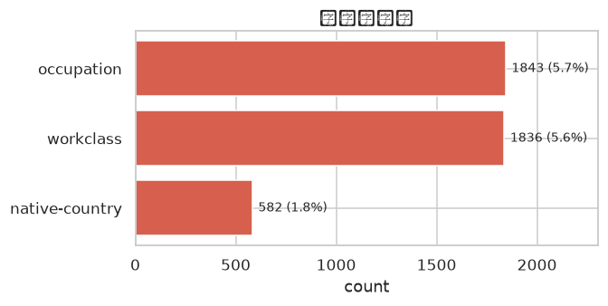

> 数值列无缺失；3 个类别列有缺失，合计占比 < 4%。

### 3.2 数值列直方图

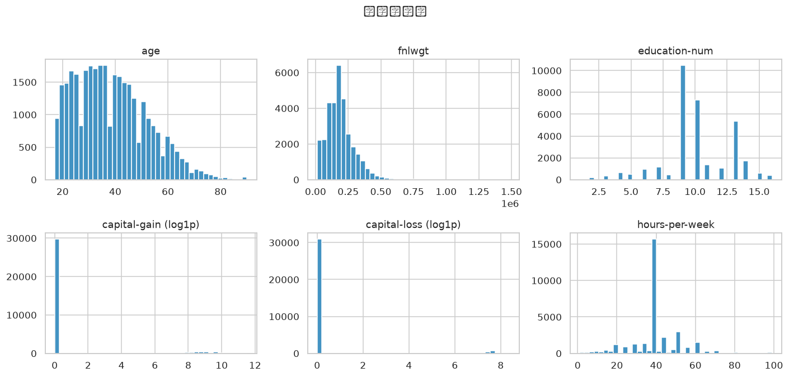

- `age`：右偏，集中 25–45 岁
- `fnlwgt`：长尾分布
- `education-num`：多峰，9 (HS-grad) 与 13 (Bachelors) 为主
- `capital-gain` / `capital-loss`：**>90% 为 0**，极端长尾（已用 `log1p` 视角展示）

### 3.3 数值列箱线图

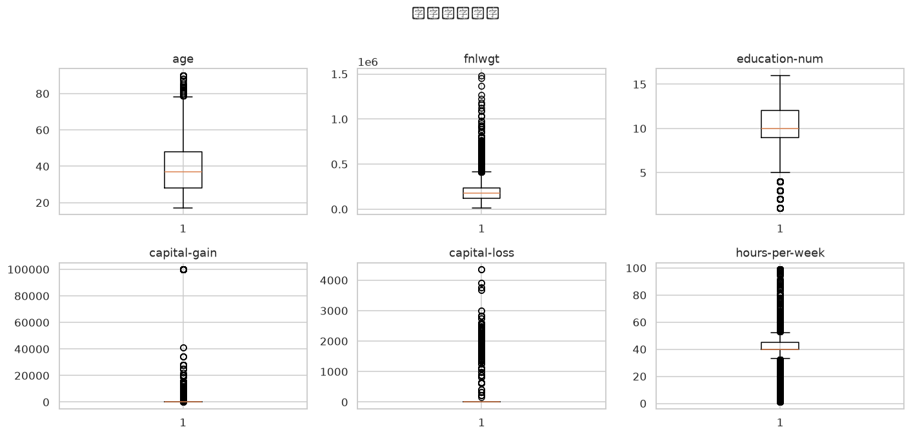

> `capital-gain` / `capital-loss` / `fnlwgt` 存在大量离群点。

### 3.4 类别列频次

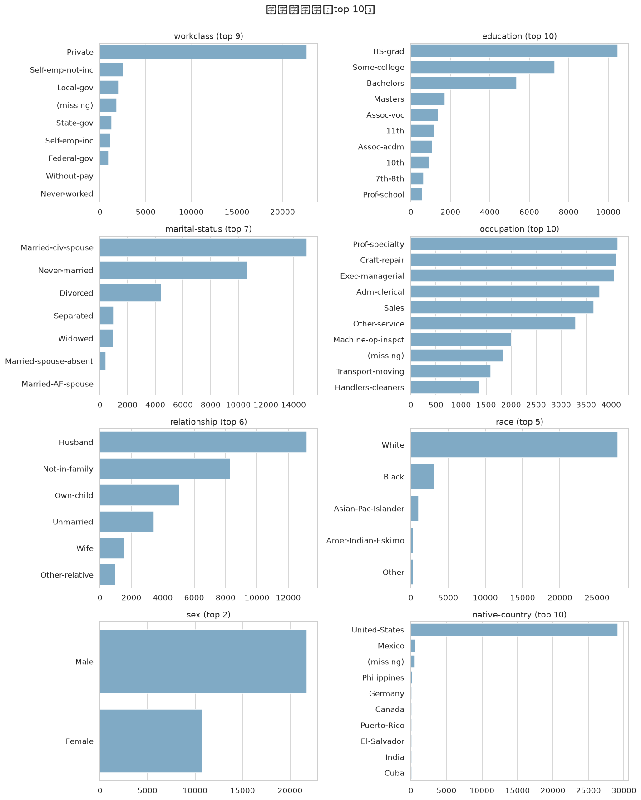

- `workclass`：Private 占 69.7%
- `education`：HS-grad / Bachelors / Some-college 三档合计 ~64%
- `race`：White 85.5%
- `sex`：Male 66.9%
- `native-country`：United-States 91.4%，其他国家样本极少

### 3.5 目标分布

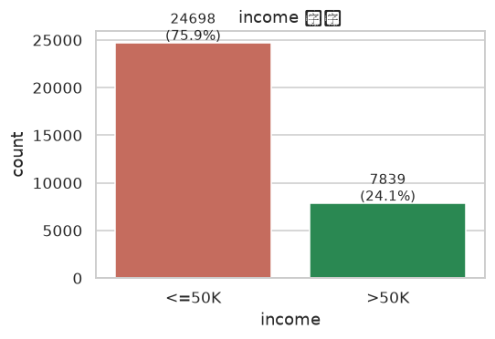

| 标签 | 数量 | 占比 |
| --- | --- | --- |
| `<=50K` | 24 720 | 75.9% |
| `>50K` | 7 841 | 24.1% |

> **类别不平衡**：正负比例约 3 : 1。

---

## 4. 双变量 EDA：income vs 各特征

### 4.1 数值特征按 income 分布

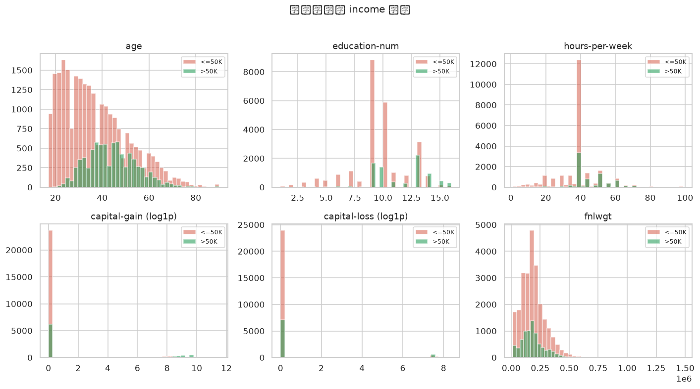

- `age`：>50K 群体明显右移（中位数 ~44 vs ~36）
- `education-num`：>50K 集中在 13–16
- `hours-per-week`：>50K 群体工时更长
- `capital-gain` / `capital-loss`（log1p 视角）：>50K 群体有明显非 0 长尾

### 4.2 类别特征 vs `>50K` 比例

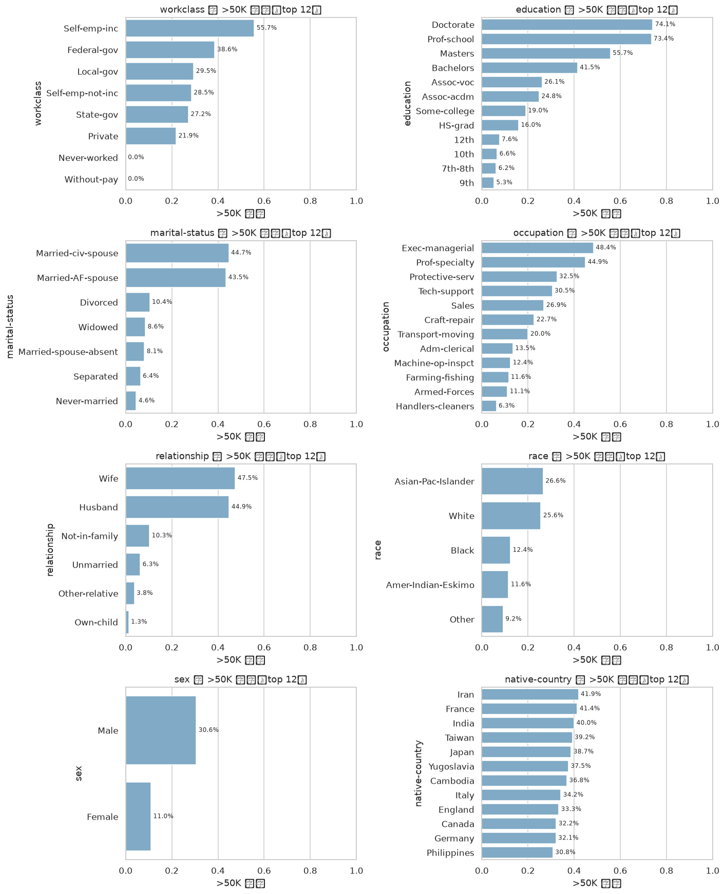

| 特征 | 高分组 | >50K 比例 |
| --- | --- | --- |
| marital-status | Married-civ-spouse | ~45% |
| relationship | Husband / Wife | ~45% / ~35% |
| sex | Male | ~30% |
| education | Bachelors / Masters / Prof-school / Doctorate | 40–80% |
| occupation | Exec-managerial / Prof-specialty | ~48% / ~45% |

---

## 5. 多变量 EDA

### 5.1 数值相关矩阵

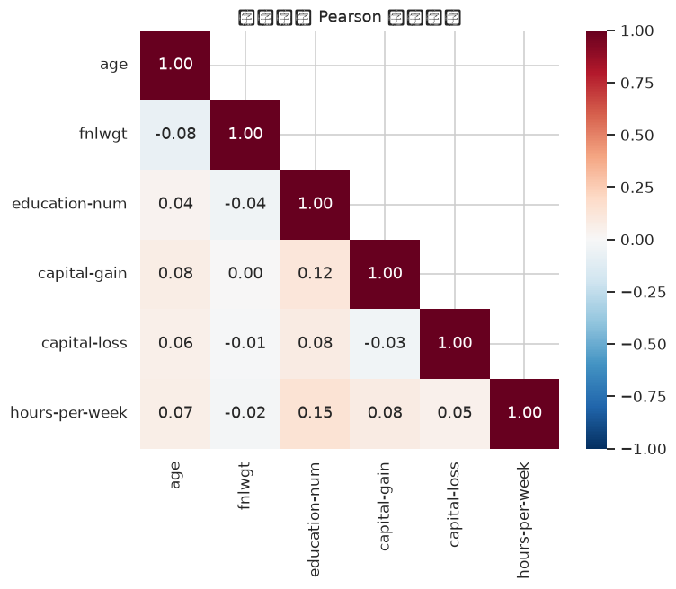

数值特征之间整体相关性弱：
- `education-num` 与 `age` 微弱正相关（~0.04）
- `hours-per-week` 与 `age` 微弱正相关（~0.07）
- `capital-gain` 与 `capital-loss` 几乎独立

### 5.2 学历 × 婚姻 → >50K 比例热力图

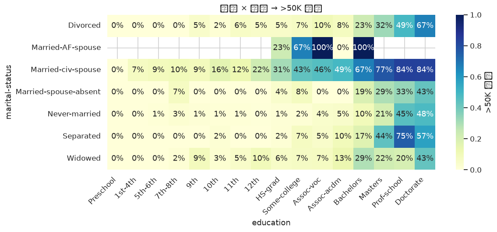

> 在 **Married-civ-spouse** 列下，>50K 比例随学历阶梯单调上升（Preschool < 10%，Doctorate > 75%）。其他婚姻状态下整体偏低。

### 5.3 EDA 关键洞察

1. **样本规模**：32 537 条记录；3 个类别列存在少量 `?` 缺失。
2. **类别不平衡**：`<=50K` 占 75.9%——以 AUC / F1 为主指标。
3. **`capital-gain` / `capital-loss` 极度右偏**：>90% 为 0，已用 `log1p` 视角展示。
4. **强区分度的特征**：`age` / `education-num` / `hours-per-week` 与 income 明显正相关。
5. **类别特征**：`marital-status` / `relationship` / `sex` / `education` 显示出强结构差异。
6. **native-country 极度不均衡**：United-States 占 91%，其他组样本稀少，模型中应警惕过拟合。

---

## 6. 数据预处理

```python
# 6.1 缺失填补：类别列用众数
for c in CAT_COLS:
    if df[c].isna().any():
        df[c] = df[c].fillna(df[c].mode().iloc[0])

# 6.2 目标二值化
df["income_bin"] = (df[TARGET].str.strip() == ">50K").astype(int)

# 6.3 One-Hot + 划分
X = pd.get_dummies(df[NUM_COLS + CAT_COLS], drop_first=True)
y = df["income_bin"]
X_train, X_test, y_train, y_test = train_test_split(
    X, y, test_size=0.2, stratify=y, random_state=42,
)
```

- `X_train`: `(26029, 96)`，`X_test`: `(6508, 96)`
- 使用 `stratify=y` 保证测试集正负比例与训练一致

---

## 7. 建模与评估

### 7.1 5 折交叉验证

```python
candidates = {
    "LogisticRegression": LogisticRegression(max_iter=2000, n_jobs=-1),
    "DecisionTree":       DecisionTreeClassifier(max_depth=10, random_state=42),
    "RandomForest":       RandomForestClassifier(n_estimators=300, n_jobs=-1,
                                                 random_state=42),
    "GradientBoosting":   GradientBoostingClassifier(random_state=42),
}
```

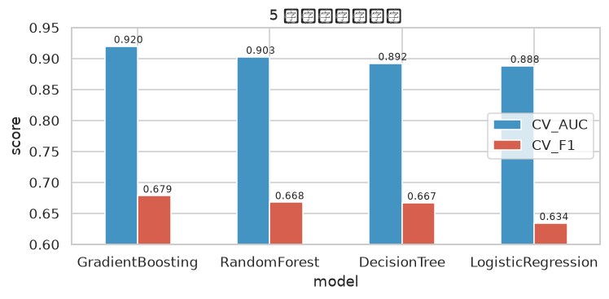

| 排序 | 模型 | CV AUC | CV F1 |
| ---: | --- | ---: | ---: |
| 1 | **GradientBoosting** | **0.9200** | **0.6785** |
| 2 | RandomForest | 0.9026 | 0.6680 |
| 3 | DecisionTree | 0.8923 | 0.6671 |
| 4 | LogisticRegression | 0.8881 | 0.6343 |

### 7.2 测试集评估

| 排序 | 模型 | accuracy | F1 | ROC AUC |
| ---: | --- | ---: | ---: | ---: |
| 1 | **GradientBoosting** | **0.8719** | **0.7015** | **0.9272** |
| 2 | RandomForest | 0.8628 | 0.6955 | 0.9113 |
| 3 | DecisionTree | 0.8634 | 0.6764 | 0.9031 |
| 4 | LogisticRegression | 0.8502 | 0.6568 | 0.8966 |

### 7.3 最佳模型详细评估（GradientBoosting）

```
              precision    recall  f1-score   support
       <=50K     0.8887    0.9502    0.9184      4940
        >50K     0.7993    0.6250    0.7015      1568
    accuracy                         0.8719      6508
   macro avg     0.8440    0.7876    0.8100      6508
weighted avg     0.8672    0.8719    0.8662      6508
```

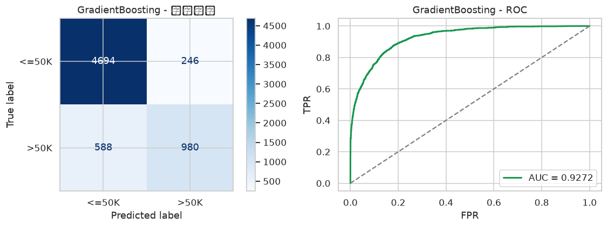

> 正例 recall 偏低（0.625），可通过 `class_weight` / SMOTE 改进。

---

## 8. 特征重要性

### 8.1 Random Forest 特征重要性

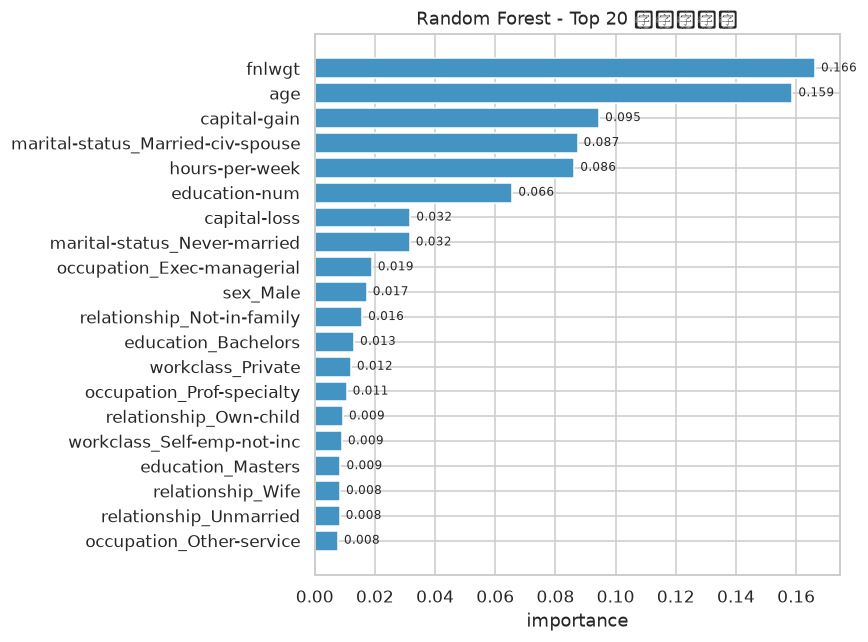

Top-10：

1. `fnlwgt`
2. `age`
3. `capital-gain`
4. `hours-per-week`
5. `education-num`
6. `capital-loss`
7. `marital-status_Married-civ-spouse`
8. `relationship_Husband`
9. `relationship_Wife`
10. `education-num` / 高学历 One-Hot

### 8.2 排列重要性（Permutation Importance）

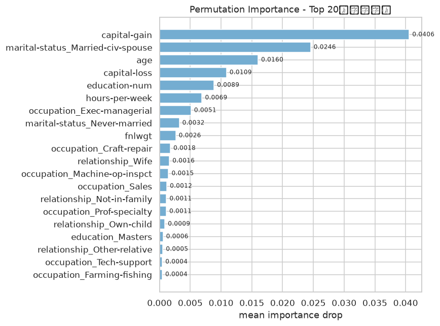

> Permutation Importance 更稳健；它显示 `capital-gain` / `age` / `hours-per-week` 排前三，`relationship_Husband` / `_Wife` 与 `marital-status_Married-civ-spouse` 紧随其后。

---

## 9. 结论与建议

1. **最佳模型**：`GradientBoosting`，测试集 AUC ≈ 0.927，F1 ≈ 0.702，accuracy ≈ 0.872，显著优于线性基线。
2. **强解释性特征**（综合 RF 重要性 + 排列重要性）：
   - 资本性收入（`capital-gain` / `capital-loss`）
   - 年龄与工时（`age` / `hours-per-week`）
   - 婚姻 / 家庭角色（`Married-civ-spouse` / `Husband` / `Wife`）
   - 学历（`education-num` 与 Bachelors / Masters / Prof-school / Doctorate）
   - 职业（`Exec-managerial` / `Prof-specialty` / `Sales`）
3. **类别不平衡**：>50K 仅 24%，以 AUC / F1 评估；可尝试 `class_weight='balanced'` 或 SMOTE。
4. **可改进方向**：
   - `native-country` 改用 target-encoding 或频率编码
   - `capital-gain` / `capital-loss` 增 0 / 非 0 二值化特征
   - Stacking / 贝叶斯优化调参
5. **伦理提示**：性别 / 种族 / 原籍在数据中存在显著差异。本数据集主要用于方法学与教学，真实业务需先做公平性审查（demographic parity / equalized odds）。

---

## 复现

```bash
# 安装依赖
uv venv .venv --python 3.12
uv pip install --python .venv/bin/python \
    pandas numpy matplotlib seaborn scikit-learn jupyter nbconvert ipykernel

# 执行并导出 HTML + Markdown
.venv/bin/python build_notebook.py
# 当前 .md 报告：income-analysis.md
```
